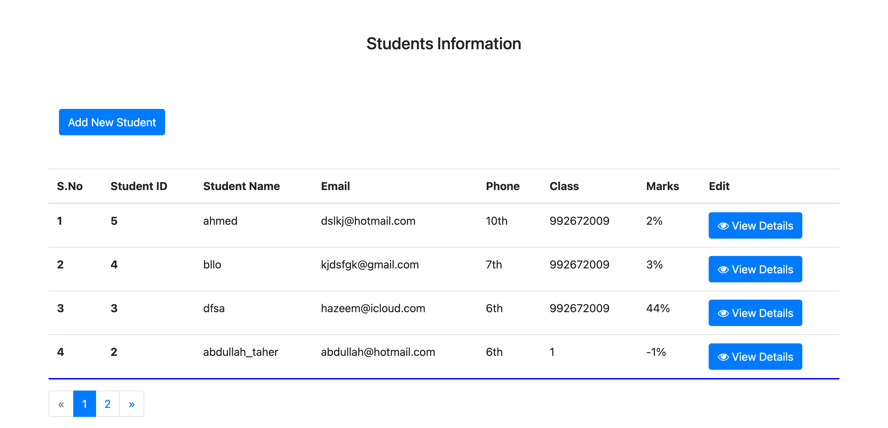
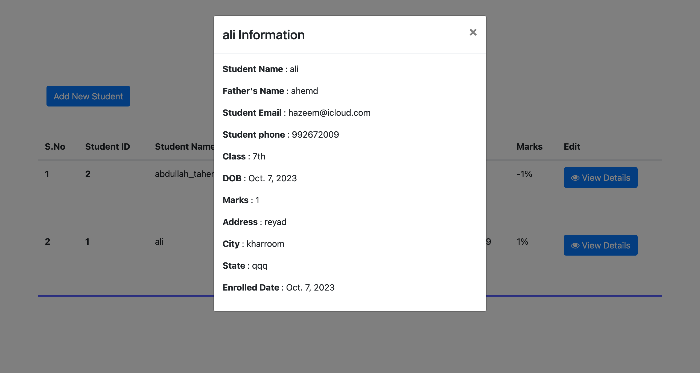
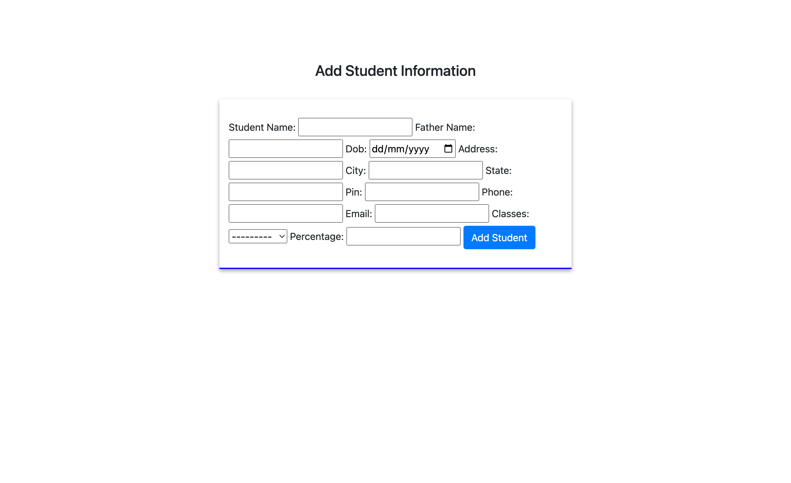

# Student Records Management System

This project is a Student Records Management System created using Django and Django Forms.

## Project Details

- **Django Frameworks**: This project is built using the Django web framework.
- **Applications**: The project consists of one Django application.
- **Features**: It includes forms models for managing student records.
- **Crispy Forms**: The project uses the Crispy Forms library for rendering forms.

## Features

- Add and manage student records.
- View a list of all student records.
- Edit and update student information.
- Delete student records.

<h2>Screenshot of the projects 📸</h2>

<h1>Student Records : 🏡</h1>

<h1>Student Information : 🏡</h1>

<h1>Add Student: 🏡</h1>

